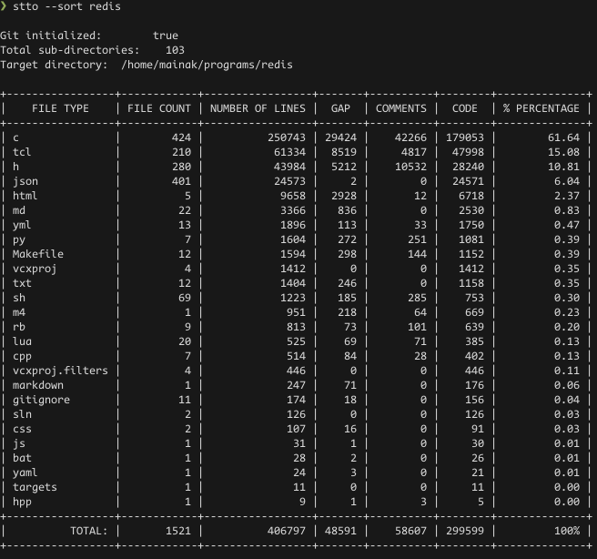
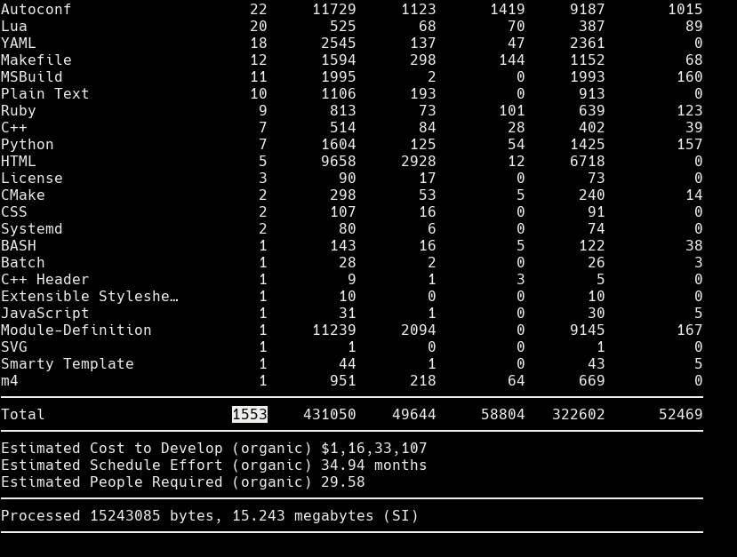
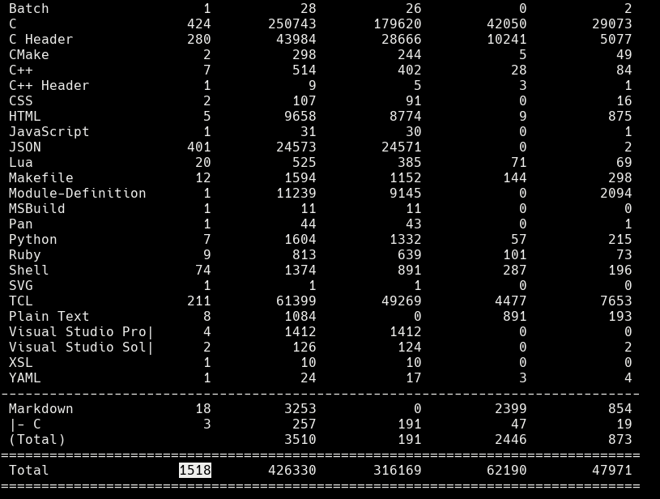
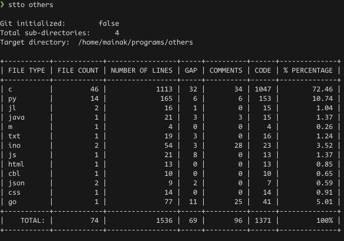
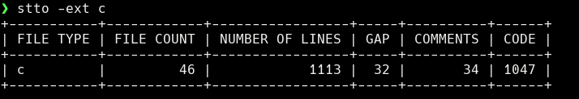
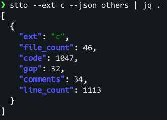

# STTO

Command-line utility written in Go to check total line of code in a file present in a directory.

## Authors

- [Mainak Bhattacharjee](https://github.com/mainak55512)

## Dependencies

- go 1.22.5
- github.com/mattn/go-runewidth v0.0.9
- github.com/olekukonko/tablewriter v0.0.5

## Benchmark

#### Benchmark was run on the clone of '[Redis](https://github.com/redis/redis)' repository


**N.B: stto is no way near the more established options like 'scc' or 'tokei' in terms of features. It is in early development stage and isn't production ready.

All the tools read over 1.5k files




## Installation

Install using the following command for latest features
```bash
go install github.com/mainak55512/stto@latest
```
Alternatively you can use the optimized builds from the [release section](https://github.com/mainak55512/stto/releases)

N.B. Release builds are generally more optimized but lack latest features, 'go install' command is the prefered way to download the executable.

## Usage

Full usage details available in 
```bash
stto --help
```

### Usage 1:


### Usage 2:


### Usage 3:


N.B. 'jproc' is a json query tool writtrn in javascript. For more details check out the [repo](https://github.com/mainak55512/JSONProcessor).

### Code of Conduct

In the interest of fostering an open and welcoming environment, we ask that all contributors adhere to the following Code of Conduct:

**Our Standards:**
- Use welcoming and inclusive language.
- Respect differing viewpoints and experiences.
- Accept constructive feedback gracefully.
- Prioritize the community’s well-being.
- Show empathy towards other community members.

**Unacceptable Behaviors:**
- Use of sexualized language, harassment, or unwelcome attention.
- Trolling, insulting comments, or personal attacks.
- Publishing private information without consent.

For any concerns or reports of unacceptable behavior, please contact [Mainak Bhattacharjee](https://github.com/mainak55512).

## 🚀 About Me
I'm a Tech enthusiast and a hobby programmer.
You can visit my [Github profile](https://github.com/mainak55512) to see my other works :)

